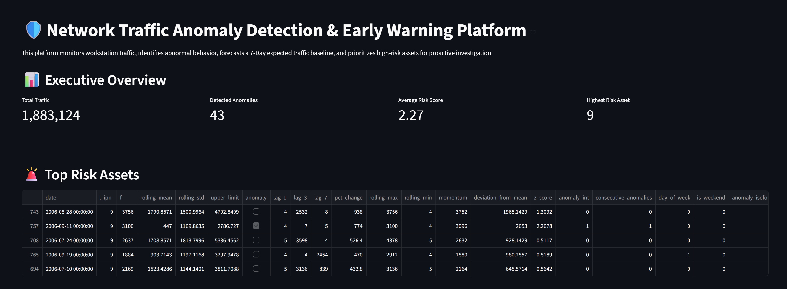
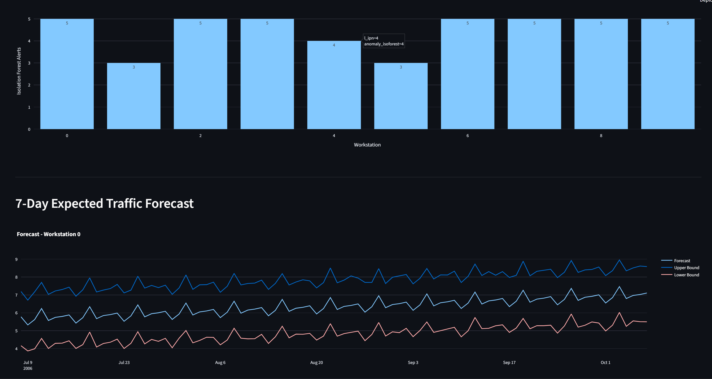

# 🛡️ Network Traffic Anomaly Detection & Early Warning System (v1.0)

An end-to-end network analytics platform designed to proactively identify abnormal workstation behavior, prioritize high-risk assets, forecast expected traffic baselines, and provide actionable intelligence for network operations teams.

---

## Executive Summary

Network incidents are often investigated only after suspicious activity has already been reported by users or detected through manual review. This reactive approach can delay incident response and increase operational risk.

This project demonstrates how statistical monitoring, machine learning, behavioral analytics, traffic forecasting, and risk scoring can be combined to create an early warning system for network operations.

Using historical network traffic data collected from multiple workstations, the platform identifies abnormal communication patterns, detects unusual behavioral changes, evaluates external communication diversity across Autonomous Systems (ASNs), forecasts expected traffic baselines, and prioritizes assets according to operational risk.

The result is a reproducible analytics pipeline that transforms raw network traffic data into actionable operational intelligence.

---

## Business Problem

Organizations often rely on user complaints or manual investigations to identify compromised devices and abnormal network activity.

This creates several challenges:

* Delayed detection of suspicious behavior
* Limited visibility into emerging threats
* Difficulty prioritizing assets requiring investigation
* Reactive rather than proactive network monitoring

The objective of this project is to provide an analytical framework capable of identifying unusual workstation behavior before incidents escalate.

---

## Dataset Source

This project uses the **Computer Network Traffic Data** dataset publicly available on Kaggle.

Dataset Characteristics:

* Approximately 21,000 observations
* 10 monitored workstations
* Daily network traffic records
* Historical period: July 2006 – September 2006
* Several workstations were known to have been compromised and became members of botnets during the observation period

Features:

* `date` — observation date
* `l_ipn` — local workstation identifier
* `r_asn` — remote Autonomous System Number
* `f` — daily network flow count

The dataset provides a realistic environment for anomaly detection, traffic monitoring, behavioral analysis, and risk assessment.

---

## Dashboard

### Executive Overview



### Workstation Analysis & Anomaly Detection


### Traffic Forecasting



---

## Public Demo

The Streamlit Cloud deployment uses analytical outputs generated by the production pipeline and exported as static datasets for demonstration purposes.
The underlying production workflow remains PostgreSQL-backed and Docker-ready.
**Live Demo**: [Link](https://network-traffic-anomaly-detection-early-warning-system-gqxg8ef.streamlit.app/)

---


## Key Capabilities

### Statistical Anomaly Detection

Detects unusual traffic spikes using:

* Rolling averages
* Rolling standard deviations
* Dynamic thresholds
* Z-score analysis

### Behavioral Anomaly Detection

Identifies abnormal workstation behavior using:

* Isolation Forest
* Historical behavioral patterns
* Outlier detection techniques

### ASN Communication Intelligence

Measures communication diversity across external Autonomous Systems to identify unusual communication patterns that may indicate suspicious activity.

### Traffic Forecasting

Generates a 7-day expected traffic baseline using Prophet to establish expected operating conditions and support proactive monitoring.

### Risk Prioritization

Combines multiple analytical indicators into a workstation risk score to help operations teams prioritize investigations.

### Interactive Monitoring Dashboard

Provides:

* Risk ranking
* Traffic trends
* Forecast monitoring
* Anomaly visualization
* ASN intelligence analysis
* Executive-level operational metrics

---

## Solution Architecture

```text
Raw Network Traffic
        ↓
Data Processing & Cleaning
        ↓
Feature Engineering
        ↓
Statistical Anomaly Detection
        ↓
Isolation Forest Detection
        ↓
Traffic Forecasting
        ↓
Risk Scoring
        ↓
PostgreSQL Storage
        ↓
Streamlit Dashboard
        ↓
Docker Deployment
```

---

## Key Insights

The analysis revealed that:

* Network behavior differs significantly across workstations.
* Statistical anomalies can be detected before manual investigation would typically occur.
* ASN communication diversity provides valuable context beyond traffic volume alone.
* Certain workstations consistently exhibit elevated risk scores.
* Short-term traffic baselines are more reliable than long-range forecasts due to limited historical data and weak seasonality.

---

## Results

✅ Detected abnormal workstation behavior across the network

✅ Identified high-risk assets requiring investigation

✅ Built behavioral anomaly detection using Isolation Forest

✅ Developed ASN communication intelligence metrics

✅ Generated expected traffic baselines for proactive monitoring

✅ Delivered an interactive operational dashboard

✅ Created a reproducible PostgreSQL-backed analytics pipeline

---

## Technology Stack

### Data Engineering

* Python
* Pandas
* NumPy

### Machine Learning & Analytics

* Scikit-Learn
* Isolation Forest
* Prophet

### Data Storage

* PostgreSQL

### Visualization

* Streamlit
* Plotly

### Deployment

* Docker

---

## Installation

```bash
git clone <repository-url>

cd network-traffic-anomaly-detection

pip install -r requirements.txt
```

Run the pipeline:

```bash
python src/pipeline.py
```

Launch the dashboard:

```bash
streamlit run dashboard/app.py
```

---

## Release Notes

###  Version 1.0

Current capabilities:

* Statistical anomaly detection
* Isolation Forest behavioral analytics
* ASN communication diversity analysis
* 7-day traffic forecasting
* Workstation risk scoring
* PostgreSQL integration
* Interactive Streamlit dashboard
* Docker-ready deployment

---

## Roadmap

### Version 1.1

* Real-time alert generation
* Email notifications
* Alert explainability
* Automated reporting

### Version 1.2

* XGBoost risk prediction
* Ensemble forecasting
* Dynamic risk thresholds

### Version 2.0

* Real-time streaming analytics
* SIEM integration
* Network graph visualization
* Kubernetes deployment
* Multi-site monitoring support

---

## Disclaimer

The dataset used in this project was obtained from publicly available sources. All rights remain with the original dataset creators.

This repository is intended for educational, research, and portfolio purposes and demonstrates practical applications of data science, machine learning, forecasting, anomaly detection, and analytics engineering in network monitoring.

---

## Author

**Bantar Harris Ndzi**

Data Scientist | Network Analytics | Machine Learning | Telecom & Network Operations

Network Traffic Anomaly Detection & Early Warning System — Version 1.0
